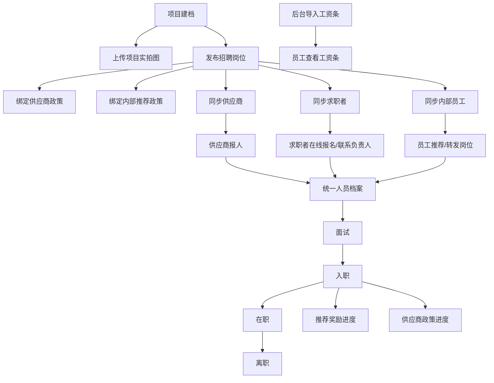

# 祥能人员与招聘信息管理系统 V2.0

> **完整产品需求与 Codex 开发任务书**  
> 适用端：电脑管理端、内部运营小程序、供应商小程序、求职者/员工小程序、微信公众号  
> 本文档已经将**招聘需求、岗位发布、外部报名、内部推荐、工资条、项目实拍图、政策分流**纳入主系统，不是附录补丁。

---

## 0. 交付目标

建设一套围绕“项目、岗位、人员、供应商、政策”统一运转的信息系统：

- 报名时一次录入人员基础信息；
- 面试、入职、离职只更新状态和新增信息；
- 管理者可按分子公司、项目、供应商查看人数并下钻人员名单；
- 运营老师可在微信小程序完成现场报名和状态修改；
- 后台可发布招聘岗位并同步给供应商、求职者和内部员工；
- 求职者可在线报名，也可直接联系项目负责人；
- 内部员工可推荐人员、查看奖励进度和工资条；
- 项目实拍图、供应商政策、内部推荐政策均统一维护并自动绑定。

### 0.1 不得违背的设计原则

1. **不重复录入。** 已填写的项目、岗位、供应商、推荐人等后续直接沿用，必要时修改原字段。
2. **一套人员档案。** 供应商报人、求职者报名、员工推荐最终进入同一人员库。
3. **字段精简。** 不新增“实际项目”“实际岗位”“用工类型”等重复项。
4. **移动优先。** 现场操作必须在微信小程序完成，电脑端用于管理、批量处理和统计。
5. **政策不写死。** 岗位只绑定政策，供应商政策与内部推荐政策分开。
6. **统一数据库。** 官网、小程序、公众号共用同一后台数据。
7. **数字可下钻。** 所有统计人数均可点击查看对应人员。
8. **不展示员工头像。** 头像对本系统无业务价值。

---

## 1. 产品范围

### 1.1 本期必须实现

1. 数据可视化首页
2. 人员报名、面试、入职、在职、离职管理
3. 人员花名册、查询、筛选、导入、导出
4. 项目建档及项目实拍图
5. 供应商建档、级别和人员数据
6. 供应商政策管理
7. 内部推荐政策管理
8. 招聘需求与岗位发布
9. 求职者岗位列表、岗位详情、在线报名、联系负责人
10. 供应商招聘需求同步及报人
11. 内部员工岗位转发、推荐、奖励进度
12. 员工工资条导入、发布、查看
13. 保险多选：商保、社保、风险金
14. 人员附件与备注
15. 微信公众号关键状态通知
16. 角色权限与属地化数据范围

### 1.2 本期不做

- 完整工资计算引擎
- 供应商付款和甲方结算
- 发票、回款、CRM
- 宿舍、考勤、劳保完整模块
- 复杂 BPM 审批平台
- AI 自动决策

---

## 2. 系统入口与角色

### 2.1 电脑管理端

面向：总部管理者、分子公司负责人、资源人员、数据人员、系统管理员。

菜单：

- 首页
- 人员管理
- 项目管理
- 供应商管理
- 政策管理
  - 供应商政策
  - 内部推荐政策
- 招聘管理
  - 招聘需求
  - 报名与招聘进度
  - 推荐奖励审核
- 工资条管理
- 统计分析
- 数据导入
- 系统设置

### 2.2 内部运营小程序

面向现场运营老师：

- 今日面试
- 人员报名
- 面试名单
- 入职登记
- 离职登记
- 人员查询
- 附件上传
- 人员备注

### 2.3 供应商小程序

- 招聘需求
- 需求详情
- 立即报人
- 我的人员
- 状态反馈
- 我的数据
- 我的供应商政策

### 2.4 求职者/内部员工小程序

公共求职者：

- 招聘岗位
- 岗位详情
- 在线报名
- 我的报名
- 联系项目负责人

已入职员工：

- 招聘岗位
- 内部推荐
- 我的推荐
- 推荐奖励
- 我的工资条
- 我的信息

### 2.5 微信公众号

仅承担：

- 微信身份绑定
- 关键状态通知
- 点击消息跳转小程序详情

---

## 3. 核心业务流程

---

## 4. 人员管理

### 4.1 报名阶段字段

- 姓名
- 身份证号
- 手机号
- 项目
- 岗位
- 面试日期
- 供应商
- 推荐人
- 紧急联系人姓名
- 紧急联系人联系方式
- 与本人关系

自动规则：

- 身份证号用于查重；
- 选择项目后自动带出归属分子公司；
- 供应商账号报人时自动绑定供应商；
- 员工分享链接报名时自动绑定推荐人；
- 已有人员再次报名时进入原档案，不新建重复人员。

### 4.2 面试阶段

只更新状态：

- 待到场
- 已到场
- 面试通过
- 面试未通过
- 放弃

### 4.3 入职阶段补充

- 入职日期
- 供应商政策（系统自动匹配，特殊情况可修改）
- 保险情况（多选）
- 工号（确有需要时填写）
- 附件
- 备注

### 4.4 离职阶段补充

- 离职日期
- 离职原因
- 保险情况更新
- 备注

### 4.5 保险字段

必须为多选数组：

- 商保
- 社保
- 风险金

示例：`["商保", "风险金"]`。

### 4.6 附件与备注

附件：

- 支持上传多个文件；
- 上传前由用户自行重命名；
- 上传后直接查看/下载；
- 不额外增加附件分类、审批等复杂字段。

备注：

- 每个人员一栏备注；
- 现场运营老师记录特殊情况；
- 列表显示摘要，详情查看完整内容。

### 4.7 花名册默认表头

| 姓名 | 手机号 | 项目 | 岗位 | 状态 | 面试日期 | 入职日期 | 离职日期 | 供应商 | 推荐人 | 供应商政策 | 保险 | 备注 | 操作 |
|---|---|---|---|---|---|---|---|---|---|---|---|---|---|

支持按姓名、身份证号、手机号、分子公司、项目、供应商、推荐人、状态、保险、日期筛选并导出。

---

## 5. 项目管理

### 5.1 项目档案字段

- 项目名称
- 归属分子公司
- 项目负责人
- 负责人联系方式
- 合作开始日期
- 合作结束日期
- 责任主体：甲方负责 / 我方负责 / 双方共同负责
- 项目实拍图
- 项目简介

### 5.2 项目实拍图

支持上传：

- 厂区/工作环境
- 宿舍
- 食堂
- 通勤/班车
- 其他项目展示图

每张图仅需：

- 排序
- 简短备注

项目图片自动同步到该项目所有岗位详情页。

### 5.3 项目详情数据

- 当前在职
- 本期入职
- 本期离职
- 面试人数
- 项目花名册
- 项目负责人及联系方式
- 合作期限
- 责任主体

---

## 6. 供应商管理

### 6.1 供应商档案字段

- 供应商名称
- 联系人
- 联系方式
- 供应商级别

供应商名称不可重复。

### 6.2 供应商详情

- 当前合作项目
- 当前适用政策
- 报名人数
- 已到场
- 面试通过
- 已入职
- 当前在职
- 已离职
- 人员名单

供应商只可查看自己报送的人员和自己适用的政策。

---

## 7. 政策中心

### 7.1 政策类型

#### 供应商政策

适用对象：

- 指定供应商
- 指定供应商级别

#### 内部推荐政策

适用对象：

- 普通员工
- 现场运营人员
- 其他指定员工类型

### 7.2 政策字段

- 政策名称
- 政策类型
- 归属项目
- 归属岗位
- 适用对象
- 金额/单价
- 达成条件
- 不发放/不结算条件
- 生效日期
- 失效日期
- 备注

### 7.3 绑定规则

- 招聘岗位只绑定政策，不手填固定奖励金额；
- 同一岗位可同时绑定供应商政策和内部推荐政策；
- 不同供应商级别可看到不同供应商政策；
- 不同员工身份可看到不同推荐奖励；
- 求职者不展示供应商结算政策；
- 历史报名人员保留当时匹配的政策版本。

---

## 8. 招聘管理（必须作为主模块实现）

### 8.1 招聘需求字段

- 归属项目
- 招聘岗位
- 需求人数
- 招聘要求
- 薪资待遇
- 工作时间
- 工作地点
- 报名截止时间
- 招聘状态：招聘中 / 暂停招聘 / 已招满 / 已结束
- 绑定供应商政策
- 绑定内部推荐政策
- 备注

### 8.2 自动带出

选择项目后自动带出：

- 归属分子公司
- 项目负责人姓名
- 项目负责人联系方式
- 项目实拍图
- 项目简介

项目档案修改后，岗位同步更新。

### 8.3 招聘需求列表字段

| 岗位 | 项目 | 需求人数 | 已报名 | 面试通过 | 已入职 | 剩余缺口 | 项目负责人 | 联系方式 | 截止时间 | 状态 | 操作 |
|---|---|---:|---:|---:|---:|---:|---|---|---|---|---|

### 8.4 招聘统计

- 需求人数
- 已报名人数
- 已到场人数
- 面试通过人数
- 已入职人数
- 剩余缺口
- 按项目、分子公司、供应商、推荐人统计

### 8.5 岗位同步

岗位发布后同步到：

- 供应商小程序
- 求职者岗位页
- 内部员工推荐页

---

## 9. 求职者岗位与报名

### 9.1 岗位列表

展示：

- 岗位名称
- 归属项目
- 薪资待遇
- 需求人数
- 工作地点
- 工作时间
- 招聘状态
- 项目负责人姓名
- 联系方式（脱敏）
- 在线报名
- 联系负责人

### 9.2 岗位详情

页面顺序：

1. 岗位标题和招聘状态
2. 项目实拍图轮播
3. 薪资、需求人数、工作时间、工作地点
4. 岗位要求
5. 项目简介
6. 项目负责人姓名、联系方式
7. 归属分子公司
8. 报名截止时间
9. 联系负责人 / 在线报名

### 9.3 联系负责人

- 支持一键拨打；
- 支持复制联系方式；
- 求职者联系后，运营人员可在小程序代报名；
- 项目负责人信息只从项目档案读取。

---

## 10. 内部推荐

### 10.1 推荐入口

员工可以：

- 查看可推荐岗位
- 转发岗位链接
- 转发岗位海报
- 生成个人推荐二维码
- 直接推荐报名

### 10.2 推荐首页

- 本月推荐人数
- 已入职人数
- 待达成奖励金额
- 已发放奖励金额
- 可推荐岗位

### 10.3 我的推荐

展示：

- 被推荐人姓名（必要时脱敏）
- 手机号（脱敏）
- 项目
- 当前状态
- 面试/入职日期
- 奖励金额
- 奖励状态：待达成 / 已达成 / 已发放

内部员工不可查看被推荐人的身份证、附件、保险和供应商政策。

---

## 11. 工资条

### 11.1 后台管理

- 下载导入模板
- 批量导入工资条
- 按身份证号或员工编号匹配人员
- 查看未匹配数据
- 发布
- 撤回
- 导出

### 11.2 工资条字段

- 工资月份
- 应发工资
- 实发工资
- 工时工资
- 加班费
- 补贴
- 推荐奖励
- 社保扣款
- 其他扣款
- 备注

### 11.3 员工查看

- 员工只能查看自己的工资条；
- 支持查看当前月和历史月份；
- 发布后通过公众号提醒。

---

## 12. 数据首页与统计分析

首页以可视化为主：

- 今日面试
- 面试通过
- 当前在职
- 今日入职
- 今日离职
- 本月离职
- 近 7 天入离职趋势
- 分子公司在职对比
- 人员状态分布
- 项目在职 TOP5
- 供应商贡献 TOP5
- 招聘需求与缺口
- 待处理事项/风险提醒

统计分析页用于更完整的明细表和导出，首页不堆过多长表格。

---

## 13. 微信公众号通知

### 13.1 供应商通知

- 新招聘需求
- 人员已到场
- 面试通过/未通过
- 已入职
- 已离职
- 资料需补充

### 13.2 求职者通知

- 报名成功
- 面试提醒
- 面试结果
- 入职提醒

### 13.3 员工通知

- 推荐人员已报名
- 推荐人员已入职
- 奖励已达成
- 奖励已发放
- 工资条已发布

非关键字段修改不发送通知，避免消息轰炸。

---

## 14. 权限

| 角色 | 数据范围 | 主要权限 |
|---|---|---|
| 总部管理者 | 全集团 | 查看、统计、导出 |
| 分子公司负责人 | 本分子公司 | 查看、管理本公司项目 |
| 项目运营人员 | 负责项目 | 报名、状态修改、入离职、附件、备注 |
| 资源人员 | 供应商与政策 | 供应商、政策配置 |
| 供应商 | 自身数据 | 看需求、报人、看反馈 |
| 内部员工 | 本人数据 | 推荐、工资条 |
| 求职者 | 本人数据 | 看岗位、报名、看状态 |
| 系统管理员 | 系统配置 | 账号、权限、字典、日志 |

---

## 15. 数据准确性规则

1. 人员以身份证号为唯一标识。
2. 项目名称不可重复。
3. 供应商名称不可重复。
4. 填写入职日期后状态自动转为在职。
5. 填写离职日期后状态自动转为离职。
6. 当前在职 = 上期在职 + 入职 - 离职 + 调入 - 调出。
7. 统计异常必须标红并可下钻人员。
8. 所有关键修改保存操作日志。
9. 批量导入先预览校验，再确认写入。

---

## 16. 建议数据库表

核心表：

- `branches` 分子公司
- `projects` 项目
- `project_images` 项目实拍图
- `suppliers` 供应商
- `supplier_project_relations` 供应商项目关系
- `policies` 政策
- `job_demands` 招聘需求
- `people` 人员档案
- `person_files` 人员附件
- `person_status_logs` 状态日志
- `referral_records` 推荐记录
- `referral_reward_records` 推荐奖励
- `salary_slips` 工资条
- `users` 用户
- `user_project_relations` 用户项目权限
- `notifications` 通知

### 16.1 关键字段提示

`people.insurance_types`：JSON 数组，值仅允许 `商保`、`社保`、`风险金`。

`job_demands`：必须包含 `project_id`，负责人及联系方式不冗余存储，以项目关联读取；允许做只读快照用于历史展示。

`policies.policy_type`：`SUPPLIER` / `EMPLOYEE_REFERRAL`。

---

## 17. API 模块

- `/api/people`
- `/api/projects`
- `/api/project-images`
- `/api/suppliers`
- `/api/policies`
- `/api/job-demands`
- `/api/applications`
- `/api/referrals`
- `/api/referral-rewards`
- `/api/salary-slips`
- `/api/statistics`
- `/api/imports`
- `/api/notifications`
- `/api/wechat/auth`

所有端共用同一业务 API。

---

## 18. 页面清单

### 18.1 电脑端

1. 数据可视化首页
2. 人员花名册
3. 人员详情
4. 项目管理
5. 项目详情与实拍图
6. 供应商管理
7. 供应商详情
8. 供应商政策
9. 内部推荐政策
10. 招聘需求管理
11. 招聘需求新增/编辑
12. 招聘详情及报名进度
13. 推荐奖励审核
14. 工资条导入与发布
15. 统计分析
16. 数据导入
17. 权限设置

### 18.2 内部运营小程序

1. 首页
2. 人员报名
3. 面试名单
4. 入职登记
5. 离职登记
6. 人员查询
7. 人员详情

### 18.3 供应商小程序

1. 招聘需求
2. 需求详情
3. 立即报人
4. 我的人员
5. 数据统计
6. 我的政策

### 18.4 求职者/员工小程序

1. 岗位列表
2. 岗位详情（含项目实拍图）
3. 在线报名
4. 我的报名
5. 内部推荐首页
6. 我的推荐
7. 推荐奖励
8. 我的工资条
9. 我的

---

## 19. 验收标准

### 19.1 招聘功能

- 后台可发布与项目绑定的招聘岗位；
- 可设置需求人数和招聘状态；
- 项目负责人姓名、电话、实拍图自动带出；
- 岗位可同步到供应商、求职者、内部员工；
- 三种入口报名均进入统一人员档案；
- 招聘进度可按报名、通过、入职、缺口统计。

### 19.2 政策功能

- 供应商政策与内部推荐政策独立；
- 可按供应商级别和员工类型分流；
- 岗位绑定政策，不写死金额；
- 用户只看到自己适用的政策。

### 19.3 项目展示

- 项目可上传多张实拍图；
- 支持排序和简短备注；
- 岗位详情自动展示项目图片。

### 19.4 人员与花名册

- 报名一次录入；
- 后续只更新新增信息；
- 查询、筛选、导入、导出可用；
- 保险支持商保/社保/风险金多选；
- 附件和备注可用。

### 19.5 工资条与推荐

- 后台可导入、发布、撤回工资条；
- 员工只能查看自己的工资条；
- 员工可转发岗位并自动绑定推荐人；
- 推荐进度与奖励状态可追踪。

---

## 20. Codex 执行要求

1. 严格按本文档开发，**招聘管理是主模块，不得遗漏**。
2. 不擅自增加未确认字段。
3. 不增加员工头像。
4. 不新增“实际项目”“实际岗位”“用工类型”等重复字段。
5. 人员、项目、供应商、政策、招聘需求必须真实关联，不做互不联动的演示页面。
6. 官网与小程序共用数据库和 API。
7. 先实现核心闭环，再做视觉细节。
8. 每个模块完成后必须写测试并核对验收清单。
9. 参考图只决定布局和视觉，业务字段以本文档为准。
10. 不得把招聘功能放在“后续规划”或独立附录中。

---

## 21. 参考图

| 编号 | 文件 | 用途 |
|---:|---|---|
| 01 | `reference_images/01_web_dashboard_visual.png` | 数据可视化首页 |
| 02 | `reference_images/02_web_personnel_roster.png` | 人员花名册 |
| 03 | `reference_images/03_web_person_detail.png` | 人员详情 |
| 04 | `reference_images/04_web_project_management.png` | 项目管理 |
| 05 | `reference_images/05_web_supplier_management.png` | 供应商管理 |
| 06 | `reference_images/06_miniapp_internal_home.png` | 运营小程序首页 |
| 07 | `reference_images/07_miniapp_interview_list.png` | 面试名单 |
| 08 | `reference_images/08_miniapp_supplier_home.png` | 供应商首页 |
| 09 | `reference_images/09_miniapp_supplier_people.png` | 供应商人员 |
| 10 | `reference_images/10_wechat_notifications.png` | 公众号通知 |
| 11 | `reference_images/11_web_recruitment_demand_management.png` | 招聘需求管理 |
| 12 | `reference_images/12_web_salary_and_referral_review.png` | 工资条和推荐奖励管理 |
| 13 | `reference_images/13_miniapp_job_list.png` | 岗位列表 |
| 14 | `reference_images/14_miniapp_job_detail.png` | 岗位详情 |
| 15 | `reference_images/15_miniapp_internal_referral.png` | 内部推荐 |
| 16 | `reference_images/16_miniapp_my_referrals.png` | 我的推荐 |
| 17 | `reference_images/17_miniapp_salary_slip.png` | 我的工资条 |
| 18 | `reference_images/18_miniapp_supplier_recruitment.png` | 供应商招聘需求 |

---

## 22. 最终定义

> **祥能人员与招聘信息管理系统是一套以项目和人员为核心，连接招聘发布、供应商供给、求职者报名、内部推荐、人员全流程管理和员工工资条的统一业务系统。**
